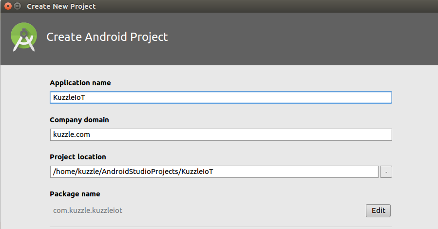

## IoT with Android

Let's create a new Android project. 




There's no need to add an Activity because we will only be using the project to perform a test.


For this test we will use the [Paho](https://github.com/eclipse/paho.mqtt.android) MQTT Android library. Once the project is created, add these line to your `build.gradle` file:


```json
repositories {
        maven {
                url "https://repo.eclipse.org/content/repositories/paho-snapshots/"
        }
}


dependencies {
        compile 'org.eclipse.paho:org.eclipse.paho.client.mqttv3:1.1.0'
        compile 'org.eclipse.paho:org.eclipse.paho.android.service:1.1.1'
}
```


Now create a Class that will handle the MQTT test, we will call it `IoTSnippet`.


## Connect to Kuzzle

The first thing we need to do is connect to Kuzzle. To do this write the following code:

```Java
//Create the mqtt client
MqttClient client = new MqttClient("tcp://localhost:1883", MqttClient.generateClientId(), new MemoryPersistence()); 

//Connect to Kuzzle
client.connect();
```

Here we assume you have installed Kuzzle on your localhost, if this is not the case replace the `localhost` with the ip or name of the Kuzzle server.

## Subscribe to the MQTT Response Topic

Now that we have established a connection to Kuzzle, we will subscribe to the Kuzzle "Kuzzle/response" Topic so that the client can listen to responses from Kuzzle:

```Java
// Listen for the Kuzzle response
client.setCallback(new MqttCallback() {
        @Override
        public void connectionLost(Throwable cause) {
        }

        @Override
        public void messageArrived(String topic, MqttMessage message) throws Exception {
        //Get the Kuzzle response
        String payload = new String(message.getPayload());
        System.out.println(topic + ": " + payload);
        doSomething(payload);
        }

        @Override
        public void deliveryComplete(IMqttDeliveryToken token) {
        }
});

//Subscribe to the Kuzzle/response topic
client.subscribe("Kuzzle/response", 1);
```

We have now programmed the subscription side of the MQTT transport.

## Publish a Request on the MQTT Request Topic

Now let's move on to the publish side of the test. Here we will publish a request to Kuzzle through the MQTT Protocol. In this case we will send a Collection Publish request.

```Java
//Publish a message to Kuzzle
JSONObject body = new JSONObject().put("volatile","message");

JSONObject payload = new JSONObject()
                        .put("index","myindex")
                        .put("collection","mycollection")
                        .put("controller","realtime")
                        .put("action","publish")
                        .put("requestId","unique_request_id")
                        .put("body",body);

client.publish(
        "Kuzzle/request", // topic
        payload.toString().getBytes("UTF-8"), // payload
        2, // QoS
        false);
```

## Run the Test

The full code should look something like this:

```Java
/* Test Class */

//Create the mqtt client
MqttClient client = new MqttClient(
        "tcp://localhost:1883", //URI
        MqttClient.generateClientId(), //ClientId
        new MemoryPersistence()); //Persistence

//Connect to Kuzzle
client.connect();

// Listen for the Kuzzle response
client.setCallback(new MqttCallback() {
        
        @Override
        public void connectionLost(Throwable cause) {
        }

        @Override
        public void messageArrived(String topic, MqttMessage message) throws Exception {
                //Get the Kuzzle response
                String payload = new String(message.getPayload());
                System.out.println(topic + ": " + payload);
                doSomething(payload);
        }

        @Override
        public void deliveryComplete(IMqttDeliveryToken token) {
        }
});

//Subscribe to the Kuzzle/response topic
client.subscribe("Kuzzle/response", 1);

//Publish a message to Kuzzle
JSONObject body = new JSONObject()
        .put("volatile","message");

JSONObject payload = new JSONObject()
        .put("index","myindex")
        .put("collection","mycollection")
        .put("controller","realtime")
        .put("action","publish")
        .put("requestId","unique_request_id")
        .put("body",body);

client.publish(
        "Kuzzle/request", // topic
        payload.toString().getBytes("UTF-8"), // payload
        2, // QoS
        false);

```

Create a test file using your favorite test framework. For a working example of this code refer to our snippet test [github repository](https://github.com/kuzzleio/kuzzle.io-snippet-tests), run the `TestIoT` test to execute the code.
