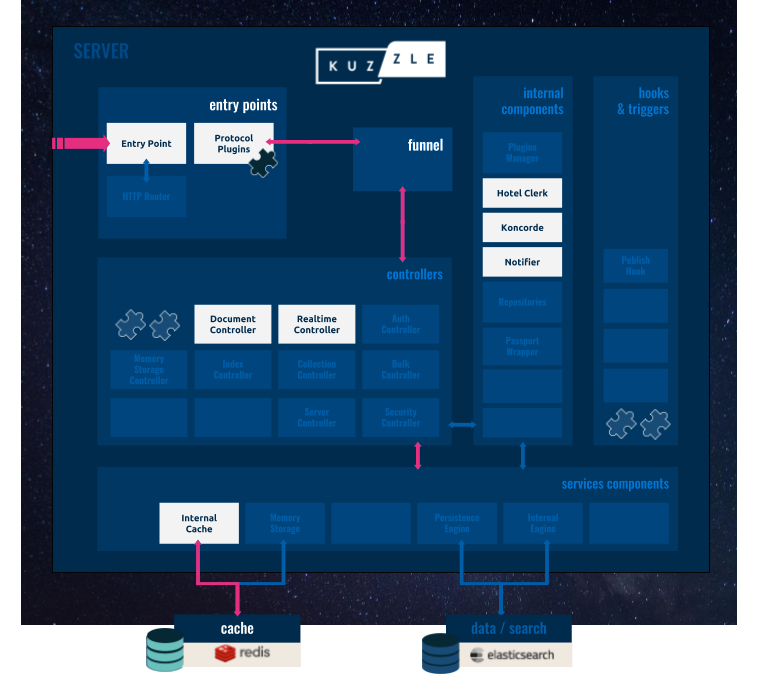
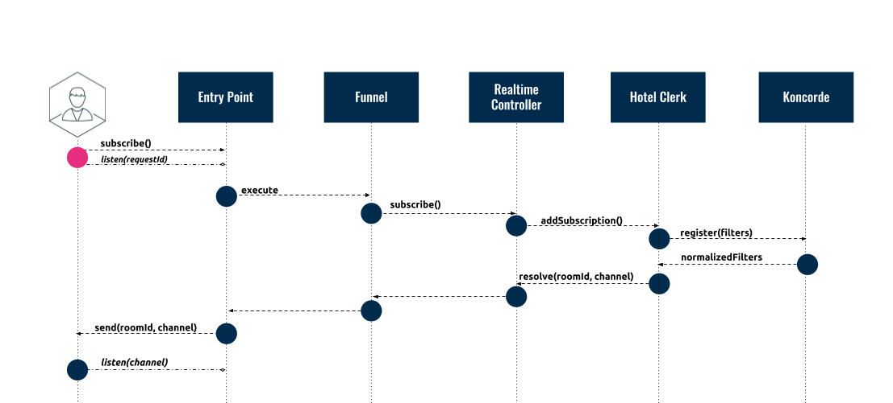
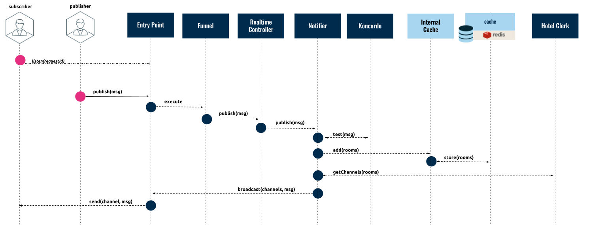
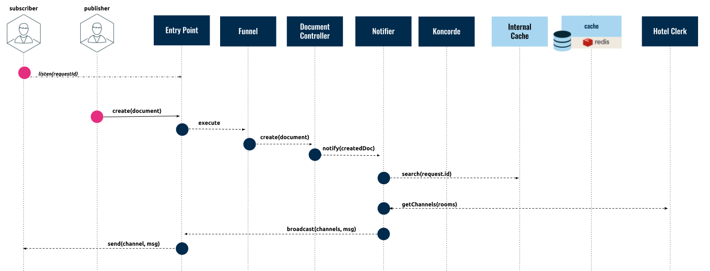

# Request Life-Cycle

In this section we are going to focus on how requests are processed by Kuzzle. We are going to analyze the life-cycle of a request in order to review Kuzzle server's internal architecture.

Kuzzle has two main modes of communication:

* **Synchronous**: Clients send requests to the Kuzzle server, which processes the data using the [Document Controller]({{ site_base_path }}api/2/controller-document) and then sends a response back to the client.

* **Asynchronous**: Clients subscribe to the Kuzzle server via the [Real-time/Subscribe]({{ site_base_path }}api/2/controller-realtime/publish) API action and receive data asynchronously as a result of a [Real-time/Publish]({{ site_base_path }}api/2/controller-realtime/publish) API action or a [Document Controller]({{ site_base_path }}api/2/controller-document) event.

These modes of communication are generally independant from the transport protocol. For example, a synchronous request can be made via HTTP or Websockets.


## Asynchronous Communication

In an asynchronous request, Kuzzle server will receive a request over one channel, process it, and trigger a response over another channel. In order to receive the response, the Client application must subscribe to the channel. Because two separate channels are used, the request and response do not need to be made by the same client nor do they need to be made sequentially.

This form of communication is generally referred to as publish/subscribe, because on the one side a client is **subscribing** to a channel and on the other side a client is **publishing** to a channel.

This subsection describes the life-cycle of real-time notifications which implement the [Publish/Subscribe](https://en.wikipedia.org/wiki/Publish%E2%80%93subscribe_pattern) pattern. In the diagram below, we highlighted the components of Kuzzle's server [architecture]({{ site_base_path }}guide/2/kuzzle-depth) that are used in this pattern:


#### Subscribing to a Channel

The following diagram shows how a client can subscribe to a channel.



* The client application opens a socket (or MQ) connection, sends a subscription request (see the [API Documentation]({{ site_base_path }}api/2/controller-realtime/subscribe)), and then listens for the `<requestId>` event on the socket. The subscription request is a message that contains a filter description that defines which events should trigger a response. For instance, the following filter will trigger a response anytime content is posted to the `users` collection that contains the field `hobby` with value `computer` (see the [Koncorde Reference]({{ site_base_path }}kuzzle-dsl/2/) for more details):

```javascript
{
  "controller": "realtime",
  "action": "subscribe",
  "index": "myindex",
  "collection": "users",
  "body": {
    "equals": {
      "hobby": "computer"
    }
  },
  "state": "all"
}
```
 <br/>
* The Kuzzle server receives the message and the *Entry Point* creates a [Request Input](https://github.com/kuzzleio/kuzzle-common-objects/blob/master/README.md#modelsrequestinput) object with the following format:

```javascript
{
  "controller": "realtime",
  "action": "subscribe",
  "resource": {
    "index": "myindex",
    "collection": "users"
  },
  "body": {
    "equals": {
      "hobby": "computer"
    }
  },
  "state": "all"
}
```
 <br/>
* The  *Entry Point* passes the `Request Input` to the *Funnel*.

* The *Funnel* validates the request and forwards it to the *Realtime Controller*.

* The *Realtime Controller* registers the subscription with the *Hotel Clerk*, an internal component that acts as a lookup table of subscribers.

* The *Hotel Clerk* calls *Koncorde* to normalize the filters and register the subscription (see [Koncorde](https://github.com/kuzzleio/koncorde) for more details). It then sends a response which includes the `channel` ID back to the *Entry Point*.

* The *Entry Point* then returns a response to the client, which includes a `<requestId>` and the `channel` ID, and looks like this:

```javascript
{
  "requestId": "ed4faaff-253a-464f-a6b3-387af9d8483d",
  "status": 200,
  "error": null,
  "controller": "realtime",
  "action": "subscribe",
  "index": "myindex",
  "collection": "users",
  "result": {
    "roomId": "78c5b0ba-fead-4535-945c-8d64a7927459",
    "channel": "c5cd8bdc-06a4-4d6e-bae3-61f1a8ac2982"
  }
}
```
 <br/>

* The client can now subscribe to the `channel` and listen to events in order to be notified any time a message is processed that matches the subscription filters.


#### Publishing to a Channel Directly

The following diagram shows how the Kuzzle server triggers a response as a result of a publish request made using the [Real-time/Publish]({{ site_base_path }}api/2/controller-realtime/publish) action.



* The *Realtime Controller* receives the **publish** request from a client and sends it to the *Notifier* component.
* The *Notifier* calls *Koncorde* to check if the content matches any filters.
* The *Notifier* uses the *Internal Cache* to store the mappings into cache.
* The *Notifier* calls the *Hotel Clerk* to get the channels related to the filters.
* The *Notifier* broadcasts the message for each channel that is linked to the filter.
* Finally, the *Entry Point* emits the message to the clients that are **subscribed** to it.

#### Publishing to a Channel Indirectly

The following diagram shows how Kuzzle uses the Document Controller to trigger a notification as a result of a change in persistent data.



* A client makes a synchronous **create** request, which goes through the Kuzzle server components to the *Document Controller*.
* The *Document Controller* sends the data to the *Persistence Engine*.
* Once the document is stored, the *Document Controller* calls the *Notifier* component.
* The *Notifier* then calls the *Internal Cache* to check if the content matches any filters.
* The *Notifier* calls the *Hotel Clerk* to get the channels related to the filters.
* The *Notifier* asks the *Entry Point* to broadcast the notification to all clients that are **subscribed** to the channels.
